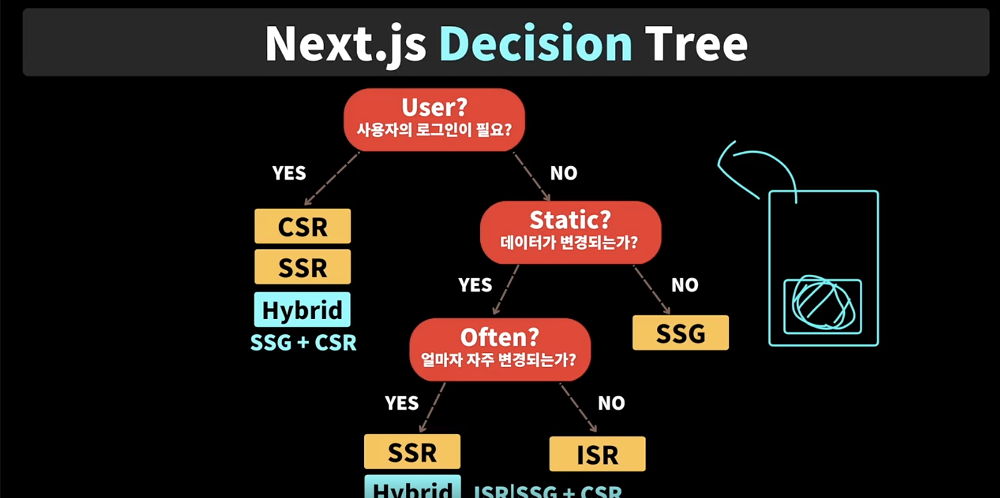

## Next.js란 무엇인가 ?

- Whats' Next.js ?

  - The **React** Framework for the web

  - React ?

    - A JavaScript library for building user interface

    - 웹, 모바일 앱을 손쉽게 만들 수 있게 해줌

    - 리액트로 만든 어플리케이션은 SPA로 간주한다

- 라이브러리

  - 무엇인가 만드는데 유용항 툴

  - 특정한 문제를 해결하기 위한 솔루션 제공

  - 꼭 사용해야 되는 것이 아니라 필요한 것만 가져다 사용해서 사용한다

  - ex. React

- 프레임워크

  - 큰 단위의 솔루션을 제공한다

  - 골격을 제공해주고 정해진 골격 안에서 로직을 작성하는 것

  - ex. Next.js

- Next.js는 아래 기능을 제공한다

  - 프론트엔드 뿐 아니라 Full-stack

  - File-based routing

  - SEO, Image, Fonr Optimization

  - Server SIde Rendering

- 즉, 리액트로 웹앱을 개발하는데 리액트 만으로 힘든 많은 것들을 가능하게 해준다

---

## 2.3 Next.js 역사와 버전 스토리

- Next.js (2016, first release)

  - open source web development framwork

  - React-based web app

  - Server-Side Rendering

  - Static Site Generation

### Next.js의 6가지 원칙

- out-of-the-box functionality requring **no setup**

  - 복잡한 설정 필요 없다

- **JavaScript** everywhere

- automic code-spliting and **server-rendering**

- configurable **data-fetching**

  - data fetching을 설정하도록 만들겠다

  - 한번만 하는지, 주기적으로 하는지, 서버에서 fetching하는지, 클라이언트에서 fetching하는지 등

- anticipating **requests**

  - 요청 사항을 예상가능하게 만들겠다

  - 사용자가 보는 페이지에서 필요한 것들만 먼저 받아오도록 한다

- simplifying **deployment**

  - 배포를 쉽게 하겠다

- Next.js

  - React 18 버전과 함께 굉장히 많은 것들이 추가되었다

  - (nested) layouts

  - new routing(/app)

  - server Components

  - streaming

  - new toolchain(Turbopack)

    - 웹팩을 능가하는

### Learning Points of Next.js ?

- 리액트는 마스터 완료하고

- 리액트가 가진 한계점이 무엇이고

- 리액트로 할 수 없는 어떤 것들을 가능하게 해주는지를 포인트로 잡는다

---

## 2.4 CSR 특징, 장/단점

- Client Side Renering

  - 렌더링하는 주체자가 Client

  - Client는 브라우저

- 처음에 홈페이지 접속하면 클라이언트가 서버에게 요청 보낸다 (request)

- 서버는 클라이언트에게 HTML을 보낸다

  - 이 HTML은 head 부분은 있지만 body가 비어있다

- 그 다음, React 소스코드와 js 파일들을 서버로 부터 다운로드 받는다

- 이렇게 다 다운로드 받으면 리액트 소스코드를 실행하고 HTML 파일에 있는 root 요소에

- js 파일에 있는 컴포넌트를 연결해서, DOM 요소를 만들고 브라우저에 페인팅 해주어야 사용자가 페이지를 볼 수 있게 된다

- 장점

  - 한번 로딩 돠면 빠른 UX 제공

    - 부분적으로 서버에 데이터를 요청해서 부분적으로 업데이트 한다

  - 서버의 부하가 적음

  - 부분적으로 데이터를 가져오기 때문

- 문제점

  - 페이지 로딩 시간 (Time To View)이 길다

  - 즉, FCP(First Contentful Paint)까지 오래 걸린다

  - 자바스크립트 활성화가 필수다

    - 자바스크립트 코드를 비화성하면 어플리케이션은 동작하지 않고 첫번째 페이지도 볼 수 없다

  - SEO 최적화가 힘들다

  - 보안에 취약하다

    - 클라이언트에 모든 코드를 받아서 실행하기 때문이다

  - CDN(Content Delivery Network)에 캐시가 안된다

    - CDN에 HTML 파일이 캐시가 되지 않는 문제가 있다

- 이런 문제점을 해결하기 위한 것이 SSG, SSR

### Q. CDN이 안된다고요????

- Cloudflare에서 현재 잘 사용하고 있습니다만

- 개발자모드로 보면 CF=hit라고 뜹니다.

- 그리고 안된다고 하시는게 더 이상한게, JS, HTML은 static file이라 캐시하기 더 쉽습니다.

### A.

- 클라이언트에서 바로 볼 수 있는 HTML (최종적인 아웃컴)이 캐쉬가 안된다는 말이였어요.

- CDN에 정적인 파일(라이브러리, 번들링된 최종 코드 파일들)은 캐쉬가 가능하지만, 궁극적으로는 클라이언트가 이런 소스 파일들을 CDN에서 받아와서 HTML로 변환해야지만 첫번째 의미있는 렌더링이 되겠죠?

---

## 2.5 CSR 직접 확인 하기!

- CRA로 만들고 네트워크 탭에서 Slow 설정하고 새로고침하면

- html문서 다운로드 받고 그 다음에 js 관련 파일들 받고

- 그 다음에 화면이 보이는 것을 확인할 수 있다

- 그리고 html 문서의 body가 비어있는 것도 확인할 수 있다

---

## 2.6 SSG 특징, 장/단점

- 렌더링하는 주체자가 서버

- 언제 렌더링 되느냐에 따라 SSR, SSG 로 정해진다

- SSG는 빌드할 때 렌더링 된다

- html 파일을 미리 서버에서 만드는 것이고

- 사용자가 한번 받아오면 다음에 홈페이지에 접속하면 서버까지 가지 않아도

- CDN에 캐시된 html파일을 다음부터는 빠르게 받아올 수 있게 된다

- 장점

  - 페이지 로딩 시간(Time To View)가 빠르다

  - 자바스크립트가 필요 없다

    - 자바스크립트 활성화 되어 있지 않아도 컨텐츠를 볼 수 있다

  - SEO 최적화가 좋다

  - 보안이 뛰어나다

    - 불필요하게 클라이언트에 js 파일 보내지 않아도 되기 때문

  - CDN에 캐시가 된다

    - html 파일만 주고 받으면 되니까

- 단점

  - 데이터가 정적이다

    - 데이터가 잘 바뀌지 않는 웹 사이트에 적합하지만 가변적으로 바뀌는 웹사이트라면 맞지 않다

  - 사용자별 정보 제공의 어려움

    - 빌드할 때, 일반적인 데이터를 가지고 미리 렌더링하기 때문이다

    - 사용자가 적으면 사용자별로 사이트를 미리 만들어둘 수도 있겠지만 사용자가 1000명, 10000명 이라면 미리 만들어 놓기 어렵다

- 이런 문제점을 해결하기 위해 나온 것이 ISR, SSR

### Q. SSG 방식으로 하면 빌드할 때 작성한 코드들이 HTML 로 만들어지는데 이때 HTML DOM 만 만들어지나요? 아니면 CSS 도 같이 만들어지는건가요??

- 강의 화면에서 스타일링도 입혀진 상태로 예제가 나오는데, SSG 방식이 스타일링 이 없는 정적인 형태로 나오는지 정말 리액트가 실행된 모든 것을 적용해서(data fetching 및 스타일 입혀진 상태) 동작하는지 궁금합니다!

### A.

- DOM 을 서버에서 만드는 것이 아니라 html 코드만 만들어주고 DOM, CSSOM 과 같은 것들은 브라우저단에서 만들어집니다.

- css 같은 경우는 브라우저에서 html 을 내려 받은 뒤에 css 를 다운로드를 받을지 style 태그가 이미 입혀진 상태로 html 을 받을 지에 따라서 달라집니다.

- 즉, CSS는 태그를 작성할때 어떻게 썼냐에 따라 달라집니다. inline으로 태그 안에 작성했다면 HTML 파일안에 CSS 속성까지 들어 있을 수 있겠죠?

---

## 2.7 ISR 특징, 장/단점

- 주기적으로 Regeneration하는 방식

- 렌더링 하는 주체가 서버이고, 주기적으로 렌더링 한다

- SSG와 동일한 원리

- 단, 정해진 주기에 따라 페이지를 다시 생성한다

- 장점

  - SSG의 장점 모두 가져간다

  - 페이지 로딩 시간(Time To View)가 빠르다

  - 자바스크립트가 필요 없다

  - SEO 최적화가 좋다

  - 보안이 뛰어나다

  - CDN에 캐시가 된다

  - 추가적으로, 데이터가 주기적으로 업데이트 된다

- 문제점

  - 주기적이긴 하지만 실시간 데이터가 아니다

  - 사용자별 정보 제공의 어려움

    - 여전히 사용자별로 달라지는 정보 제공이 어렵다

- 이런 문제점을 해결하기 위한 것이 SSR

---

## 2.8 SSR 특징, 장/단점

- 렌더링하는 주체는 서버, 요청시 렌더링한다

- 즉, 미리 페이지를 만들어두는 것이 아니다 

- 클라이언트가 서버에 홈페이지 요청을 하면

- 서버에서 해당 홈페이지에 필요한 코드를 실행해서 html 파일을 만든 다음에

- 클라이언트에 html 파일을 보내준다

- 즉, 클라이언트에서 요청이 올 때 페이지를 만들어서 준다

- 장점

  - 페이지 로딩 시간(Time To View)가 빠르다

  - 자바스크립트가 필요 없다

  - SEO 최적화가 좋다

  - 보안이 뛰어나다

  - 추가적으로, 실시간 데이터를 사용

  - 사용자별 필요한 데이터를 사용한다

    - 요청할 때 마다 렌더링 하기 때문에, 요청하는 사용자에 맞는 데이터를 제공해 줄 수 있다

- 문제점

  - 비교적 느릴 수 있다

    - 요청할 때 마다 렌더링하기 때문에 SSG, SSR과 비교했을 때 상대적으로 느릴 수 있다

  - 서버에 과부하가 걸릴 수 있다

    - 1000명의 사용자가 접속하면 1000명의 사용자에 맞는 페이지를 서버에서 페이지를 만들어서 보내주어야 하기 때문

    - 즉, 서버에 overhead가 높아진다

  - CDN에 캐시가 안된다

    - 요청할 때 마다 페이지를 만들어야 하기 때문

---

## 2.9 하이브리드의 매력 ?

- Next.js for Hybrid Web App

- Hybrid

  - 혼합이라는 뜻

- 특정 목적을 달성하기 위해 두개 이상(이중성)의 기능이나 요소를 결합

  - 목적

    - 성능좋은 강력한 Web App을 만드는 것

  - 두개 이상

    - CSR, SSG, ISR, SSR

- 각각의 페이지에 맞는 방법을 적용할 수 있고

- 한 페이지 내에서도 방법을 적절하게 섞어서 사용할 수 있다

- 이렇게 하는 이유는 각각의 렌더링 방식의 장단점이 다르기 때문이다

---

## 2.10 하이드레이션? (중요 컨셉)

- Hydration for interaction

- Hydration

  - 수화시키다

  - 물로 가득 채우다라는 뜻

- Next.js에서 '물'은 리액트

- 클라이언트가 서버에 요청하면 페이지를 생성하는데 이 때 이 페이지는 정적 HTML 페이지를 전달하는데

  - 이것을 pre-rendering이라고 한다

- 클라이언트는 이 페이지를 받아서 표시한다

- 하지만 아직 js 파일을 다운로드 받지 않았기 때문에, 해당 페이지를 클릭해도 아무런 일도 일어나지 않는다

- HTML 파일 보낸 다음에 페이지에 필요한 리액트 라이브러리와 js 소스코드를 보내준다

- 클라이언트에서 다운로드 받은 다음에 정적인 html 파일에 리액트 파일로 Hydration 해준다

- 즉, 컴포넌트로 렌더링이 발생하게 된다

- 이전까지는 정적인 html 페이지였다면 이제는 그 위에 실제의 컴포넌트를 페이지에 렌더링하게 된다

- 실제 리액트 컴포넌트이기 때문에 클릭하면 컴포넌트 내부에 로직이 실행된다

- 여기서 키 포인트는 정적인 html 페이지와 hydration 되었을 때 그 사이의 간격을 줄이는 것

---

## 2.11 웹개발시 중요한 포인트

- Web App 개발시 중요한 포인트

- TTV(Time To View)를 최대한 줄이는 것이 중요하다

- next.js 처럼 Pre rendering된다면 TTI(Time To Interact) 시간을 줄이는 것이 중요하다

- 개발자들이 항상 두가지를 염두해야 한다

- CSR

  - html 파일 뿐 아니라 js 파일등 모든 리소스를 받아야지 페이지를 볼 수 있고 사용할 수 있다

- SSR

  - 처음 페이지를 서버에서 받아와도 볼 수는 있지만 사용할 수는 없다

  - 서버에서 필요한 js 파일등 리소스를 받아야지 그 때 사용할 수 있다

  - TTI와 TTV 사이의 간극을 줄이는 거나 사용자에게 간극을 알려주는 것이 중요하다

---

## 2.12 언제 어떤걸 쓰면 좋은지 정리!

- Next.js Decision Tree

- 100% 정해진 정답 없다

- 이렇게 하니까 좋더라 정도, 참고용

- 가장 첫번째로 User?, 사용자의 로그인이 필요한지 질문해본다

  - 사용자 별로 달라지는 데이터인지 아닌지 생각해본다

  - No인 경우, Static? 데이터가 변경되는가

    - 사용자의 로그인이 필요하지 않은, 모든 사용자에게 동일하게 보여주는 데이터라면

    - 그 데이터가 얼마나 그 데이터가 변경되는지 생각한다

  - No 인 경우, SSG

    - 데이터가 잘 변경되지 않는다면

    - SSG 사용한다

  - Yes 인 경우,

    - 사용자의 로그인이 필요하지 않지만 주기적으로 변경되는 경우

    - 얼마다 데이터가 변경되는지 질문한다

      - No 인 경우, 자주 변경되지 않으면 ISR

      - Yes 인 경우, 자주 변경되거나 사용자가 즉각적으로 봐야하는 경우 SSR

        - 만약 여기서 서버에 과부하가 걸리는 것이 걱정된다면 Hybrid를 사용한다 (ISR/SSG + CSR)

        - 페이지를 ISR/SSG로 미리 골격을 만들어두고 페이지 내에서 주기적으로 바뀌는 부분만 CSR 해준다

  - Yes인 경우, 사용자의 로그인이 필요하다면

    - 사용자별로 민감한 데이터이기 때문에 CSR을 하거나 SSR을 할 수도 있다

    - 또는 Hybrid 형태로 만들 수 있다 (ISR/SSG + CSR)

### Q, SSR이 효과적으로 사용될 수 있는 구체적인 상황이 궁금합니다

- SSG는 사용자 구분이 필요 없고 데이터가 변경되지 않는 곳에, ISR는 변경은 되지만 그것이 크게 중요하지 않은 곳에 사용할 수 있다는 명확한 구분을 알게되었습니다.

- 그 외에 상황에서는 SSR과 CSR(Hybrid 포함)을 선택적으로 사용할 수 있을 것 같은데, 그 중 특별히 SSR을 사용하는게 더 나은 상황이 있을지 궁금합니다.

- SSR의 경우 서버에서 데이터를 가져오는 시간이 길어지면 흰화면을 보여주는 시간도 길어져서

- 오히려 페이지 마운트 이후 데이터를 불러오되 적절한 로딩 UI를 제공하는 것이 사용성에 더 좋지 않을까 하는 생각이 듭니다.

- 서버에 부담이 되는 문제도 있어서 SEO가 정말 중요한 페이지가 아닌 이상 특별히 사용할 이유가 없을 것 같은데, SSR을 적절히 사용할 수 있는 구체적인 상황이 궁금합니다!

### A1. 저도 궁금하네요...!

- 일단 아래와 같은 경우 SSR이 좋지 않을까 추측해 봤습니다.

- 클라이언트에 코드를 보내고 싶지 않은 부분을 SSR로?

- api 리퀘스트를 서버 사이드에서 하면 보안적으로 더 좋을듯? (클라이언트 디바이스에 쿠키 같은 인증 정보를 보관 해둘 필요도 없고, api path도 숨길 수 있을 것 같음)

- 유저 디바이스(즉, 클라이언트 디바이스)가 페이지 기능을 실행하는데 충분치 못할 수 있는 경우?

### A2.

- 웹페이지가 어떻게 구성되어있고, SEO 검색최적화가 필요한지, 사용자에게 TTV, TTI 무엇이 더 중요한지 등 요구사항에 따라서 결정될 수 있을것 같아요.

- 무신사와 같은 이커머스의 상품 목록 화면을 예를 들어볼게요.

- 요구사항이 아래와 같다면 SSR이 적합하지 않을까요?

  - 상품 목록 상품들이 검색엔진에 노출될 수 있도록 검색 최적화

  - 사용자에게 상품 목록 화면을 빠르게 보여주는 것이 최우선

  - 어드민에서 업데이트한 상품 정보가 실시간으로 반영되어야 함.

- 위 조건일 때 SSR을 사용할 경우, SEO 최적화를 통해 검색엔진 노출이 가능하고, pre-rendering을 통해 사용자에게 즉각적으로 화면을 보여줄 수 있고,

- 사용자에게 실시간 상품 정보가 반영되기 때문에 요구사항에 만족할 수 있을 것 같네요.

- 예시를 SSR에 적합한 요구사항으로 들어봤는데요, 결국 조건과 우선순위를 고려해서 적합한 렌더링 방식을 찾아 적용해보는 시행착오가 필요할 것 같아요!

### A3.

- 우선 보안상 중요한 사이트라면 민감한 스크립트를 숨기거나 CSRF를 방지할수있겠죠

- 특정 게시판이나 상품상세페이지를 카카오톡 같은 앱에 공유해야하는데 상품이미지나 타이틀같은 메타데이터가 동적으로 나와야 해서 작업한적이 있습니다

### A4.

- 다들 말씀 감사합니다!

- 보안 상이나 SEO가 이유라면 저도 어느정도 이해가 되는데 렌더링 방식을 바꿀 만한 큰 문제인지, 그런 상황이 많을지 지금은 조금 와닿지 않긴 하네요.

- SSR의 경우 서버 상태에 따라 데이터를 가져오는데 시간이 걸리면 html을 만들지 못하고 그동안 흰화면을 보여주게 되니

- 첫화면을 빨리 보여준다는 장점이 없어지고 기존 단점은 그대로 남는게 아닌가 싶어서요.

- 페이지 단위로 렌더링 방식을 정할 수 있는 v12에서 경험해본 것이라 v13은 다를 수 있지만,

- 컴포넌트 단위라고 해도 재사용 가능한 정적인 데이터가 아닌 '동적인 데이터를 굳이 매번 서버에서 불러와 렌더링 한뒤 사용자에게 전달하는 것이 유용한 상황이 있을까?'가 핵심 의문이네요!

### A. Ellie

- 모두 답변들을 정말 잘해주셔서 제가 별도로 남길 말이 없을것 같아요 ? 그리고, 이번 챕터 여러 영상에 걸쳐서 설명도 해드렸구요ㅎㅎ 그래도 조금만 더 의견을 보태 보자면:

- 우리가 배운 SSR의 장점

  - 사용자의 특화된 정보 처리

  - 막강한 SEO

  - 클라이언트는 몰라도 되는 중요한 보안 숨김!

    - 서버 리소스라면, 클라이언트가 또 요청해서 서버의 리소스를 보내줘서 클라이언트가 보는게 아니라, 서버와 가까운 리소스를 서버에서 직접 읽어 봐서 페이지를 만드니깐 불필요한 round trip을 줄임 (왕복 네트워크)

- 제기된 문제점

  - 그래도 요청시마다 서버에서 렌더링 하니 TTV가 느리지 않을까요?

  - 서버 부담 (오버 헤드)

- 자, 문제점에 대해 조금 짚어 보자면:

- 서버의 하드웨어 스펙은 우리가 사용하는 PC보다 훨씬 강력합니다. 강력하고 최고효율을 자랑하는 네트워크를 사용하죠.

- 만약 2G, 3G의 느린 네트워크와 저가형 PC 또는 모바일을 사용하는 곳이라고 가정해 볼께요.

- 그리고 페이지안에서 데이터베이스 입출력 뿐만 아니라 다발적인 네트워크 통신이 필요하다면 그 무거운 동작들을 클라이언트 측에서 하는게 빠를까요, 아니면 서버에서 처리 하는게 빠를까요? ?

- 그리고, 최근에는 Edge 네트워크의 등장으로 (날이 갈수록 서버의 성능이 정말 강력해지고 있습니다) 웹앱 전체를 무조건 SSR로 만드는 Remix같은 프레임워크도 등장했죠

- Next.js도 Edge지원을 위해 13버전 이후에 추가된 app/api Router Handler로 Edge 호환되도록 작성해야 한답니다. (나중에 뒤에서 배우실 거예요)

- 서버가 클라이언트 하드웨어 스펙보다 훨씬 강력하고, 몇만명의 요청을 가뿐히 처리할 수 있다면, 서버에서 데이터를 fetch, 데이터베이스 I/O 처리하는게 더 효율적이고 강력하다면 SSR을 사용하지 않을 이유가 없겠죠? ? (+SEO, 보안이 뛰어나는 이유를 덤으로!)

- 그러나, 말씀하신것처럼 아직까지 모든 웹앱이 Edge에서 동작할 수 있는것도 아니니, 저는 모든 웹앱을 SSR로 만드는것보다는 하이브리드 형태로 가지고 가는게 좋다고 생각해요.

- SSR 페이지 이더라도, 정말 중요한 내용 (SEO와 보안에 관련된 부분)만 SSR로 처리 하고, 나머지는 CSR로 하이브리드 형태로 가지고 가는것도 좋다고 생각합니다.
