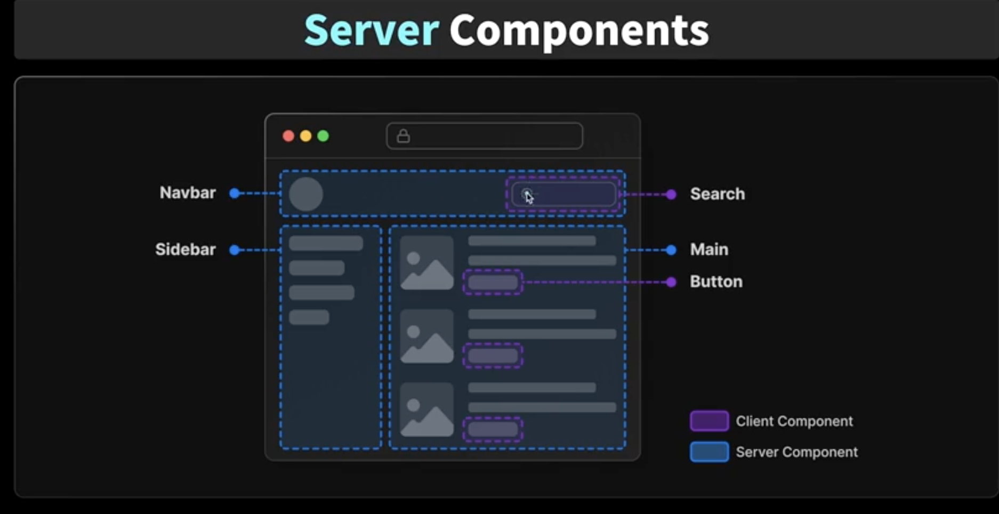

## 5.2 최신 버전의 큰 차이점

### v12

- 페이지 단위로 렌더링 방식을 규정

- 페이지 안에서 getStaticProps 사용하면 SSG

- getServerSideProps 사용하면 SSR

- 이러한 것들이 페이지 단위로

### v13

- Server Component 개념이 도입 되었다 (Server Component / Client Component)

  - 서버 상에서만 동작하는 컴포넌트

- 13 버전 부터는 페이지 단위가 아니라 컴포넌트 단위로 렌더링 단위를 규정

- 한 페이지 안에서도 어떤 것은 서버 컴포넌트, 어떤 것은 클라이언트 컴포넌트

- 이런 것 섞어서 효율적으로 페이지 구성할 수 있다



- app 폴더 안에 있는 모든 컴포넌트는 기본적으로 모두 서버 컴포넌트

  - 별도로 설정하지 하지 않는 이상 모두 서버에서 실행된다

- 서버 컴포넌트와 클라이언트 컴포넌트 실행되는 환경이 다르니까

  - 서버 컴포넌트 : 서버

  - 클라이언트 컴포넌트 : 클라이언트

- 서로 할 수 있는 것과 없는 것이 다르다

---

## 5.3 서버 컴포넌트

- app 폴더 안에 있는 모든 컴포넌트는 기본적으로 모두 서버 컴포넌트

  - 별도로 설정하지 하지 않는 이상 모두 서버에서 실행된다

  - 실제로 app/page.tsx에서 `console.log('hello');` 하면, 브라우저가 아닌 터미널에서 출력된다

- 서버에서 실행이되고, HTML 형태로 브라우저에 전달된다

- 서버에서 동작하기 때문에 브라우저에서 제공하는 api는 사용할 수 없고

- 노드 환경에서 제공하는 노드 api는 사용할 수 있다

```js
// app/page.tsx

export default function Home() {
  // 모두 터미널에서만 출력된다
  console.log('hello');
  console.log(os.hostname());
  return <h1>페이지</h1>;
}
```

- 그렇기 때문에 상태 관련된 것 사용할 수 없다

- 컴파일 관련 에러 발생한다

```js
// app/page.tsx

export default function Home() {
  // 에러 발생
  const [state, setState] = useState();

  console.log('hello');
  console.log(os.hostname());
  return <h1>페이지</h1>;
}
```

- 서버 컴포넌트와 클라이언트에서 할 수 있는 것과 없는 것 구분해야 한다
