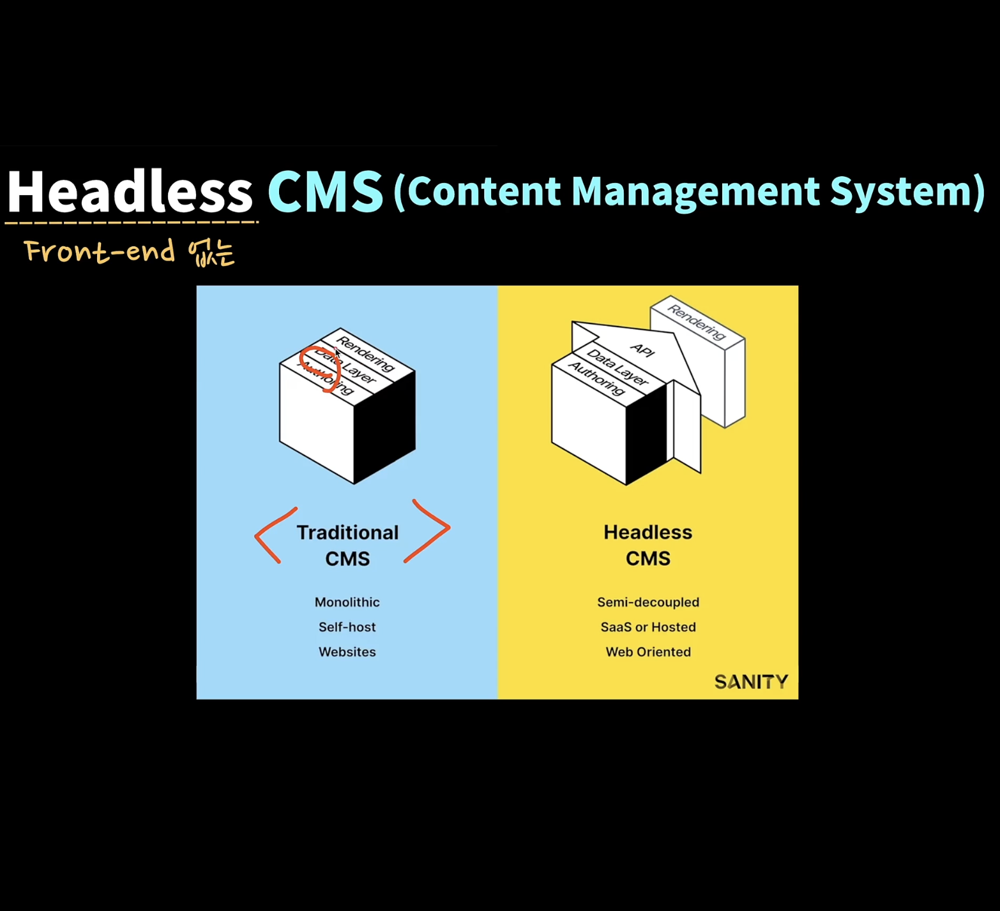
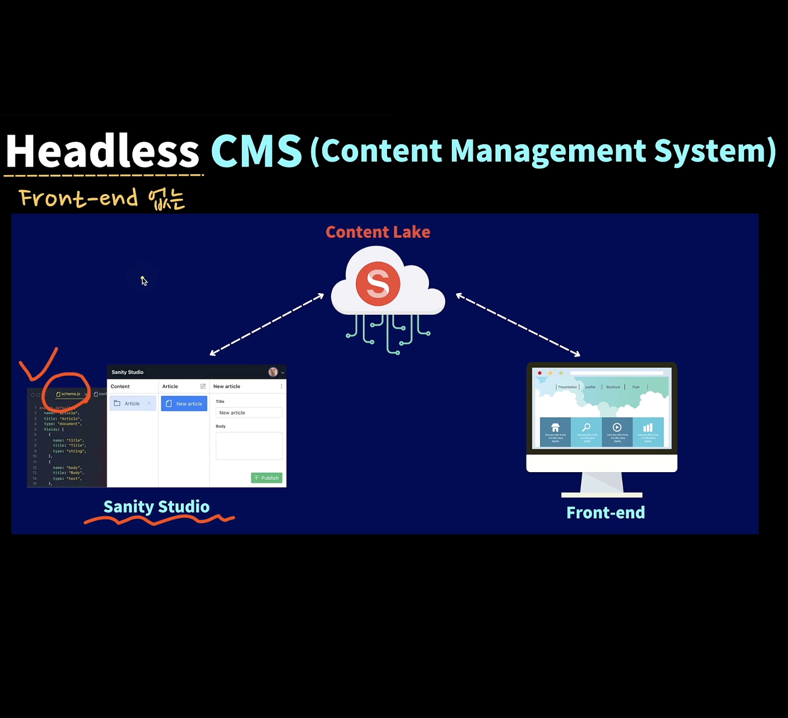

## 11.3 Headless CMS란 ?

- Headless CMS is a back end-only web content management system that acts primarily as a content repository

- A headless CMS makes content accessible via an API for display on any device, without a built-in front end or presentation layer

 

- A headless CMS is a content management system that separates where content is stored (the "body") from where it is presented (the "head).

- It separates information and presentation. This enables content reuse and remixing across web, mobile, and digital media platform as needed.

- You could event reuse your content in print

- CMS는 Content Management System의 약자ㄴ

- 웹 개발을 사람의 몸에 비유하면 Body는 Backend, 얼굴을 Head 라고 한다

- 그렇기 때문에 Headless라고 하는 것은 얼굴이 없는 즉, 프론트엔드가 없다는 뜻으로 Headless CMS라는 것은 Body를 담당하는 CMS로 백엔드만 신경을 쓰는 것이다

- 즉, 프론트엔드는 우리가 원하는 대로 자유자재로 보여줄 수 있다.

 

- 대표적인 Traditional CMS로 워드프레스가 있다

- Headless CMS는 API를 통해서 데이터를 읽고 변경할 수 있다

- 렌더링을 어디서 할 건지는 자유자재로 사용할 수 있다.

- 따라서 웹, 앱, 데스크탑 어플리케이션도 만들 수 있다.

- 워드프레스도 최근에는 지원해주지만 대표적으로 Strapi, Sanity

- Sanity는 오픈소스가 아니기 때문에 코드를 확인할 수는 없다.

- Sanity를 통해서 데이터를 저장하면 Content Lake라는 클라우드에 저장된다

- 클라우드에 있는 데이터를 읽고 쓰기 위해서 개발자 모드인 Sanity Studio를 사용해서 할 수 있다.

- 또 다른 방법으로는 Sanity에서 제공하는 API를 사용해서 접근할 수 있다,

 

## 11.4 Sanity 살펴보기

- [Sanity](https://www.sanity.io/docs)

 

## 11.5 사용한 라이브러리 소개

- [SWR](https://swr.vercel.app/)

  - 네트워트 상태 라이브러리

  - 리액트 쿼리 대신 사용하는 이유는, SWR를 Nextjs를 만든 Vercel이 만들었기 때문

- [Next Auth](https://next-auth.js.org/)

  - 사용자 로그인을 위해서 사용한다

  - 프론트, 백엔드 모두 사용할 수 있다.

- [React Spinners](https://www.davidhu.io/react-spinners/)

- [timeago](https://github.com/hustcc/timeago.js)

  - 상대적인 시간을 나타내기 위한 라이브러리

- [React Multi Carousel](https://github.com/YIZHUANG/react-multi-carousel)
