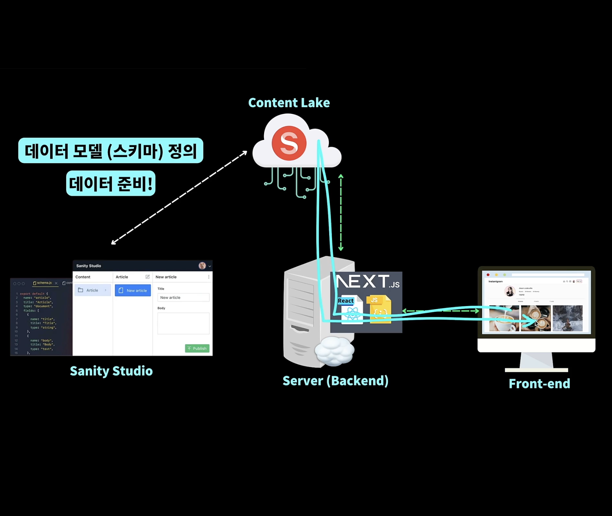

## 12.2 큰 그림 먼저 살펴보기

- Sanity에는 클라우드 상에 존재하는 데이터 보관소 Content Lake가 있다.

- Sanity Studio를 사용해서 Content Lake에 접근할 수 있다.

- 또 다른 방법으로는 Sanity에서 제공해주는 API를 사용해서 데이터를 읽고 쓸 수 있다.

- 프론트에서 직접적으로 Sanity를 사용하는 것이 아니라, 백엔드 서버를 통해 할 수 있도록 만들 것이다

- 그리고 프론트는 서버를 통해서 필요한 데이터를 가져오도록 한다

- 그리고 Content Lake와 백엔드는 캡슐화, 즉 추상화를 해놓을 것 이기 때문에 프론트엔드에서 직접 Content Lake에서 직접 데이터를 받아오는 것이 아니라 백엔를 통해서 가져올 수 있도록 한다.
