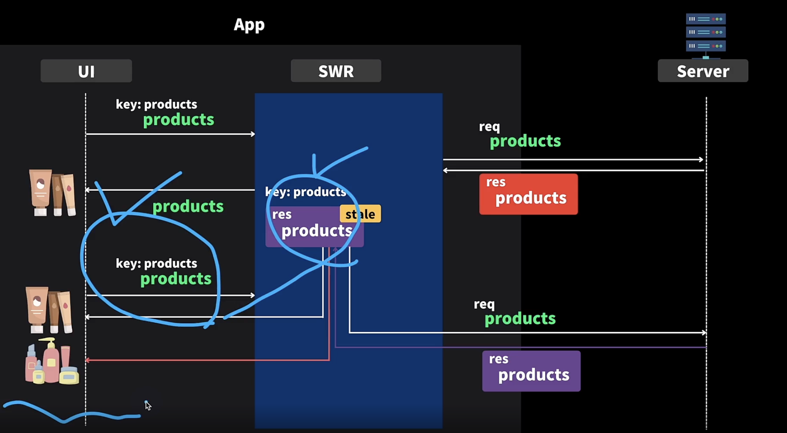

## 14.2 SWR 이해하기

- 꼭 한번 읽어보기

  - https://swr.vercel.app/ko/docs/advanced/understanding

- Fetch and Revalidate

  - Revalidate에서는 isValidating만 true가 된다

- Key Change

  - key가 변경되면 isLoading, isValidating 모두 true가 된다

- 두번째 요청을 하게 되면 stale한 것 보여주면서 백그라운드 상으로는 다시 서버에 요청해서 캐시된 데이터를 업데이트 한다

- 만약 변경사항이 없다면 UI 그대로 보이겠지만 변경사항이 있다면 UI가 업데이트 되는 것을 확인할 수 있다
